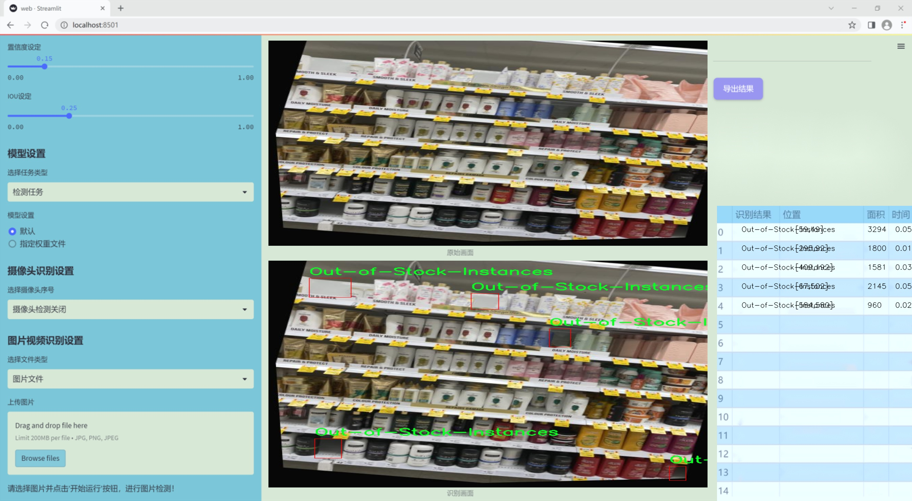
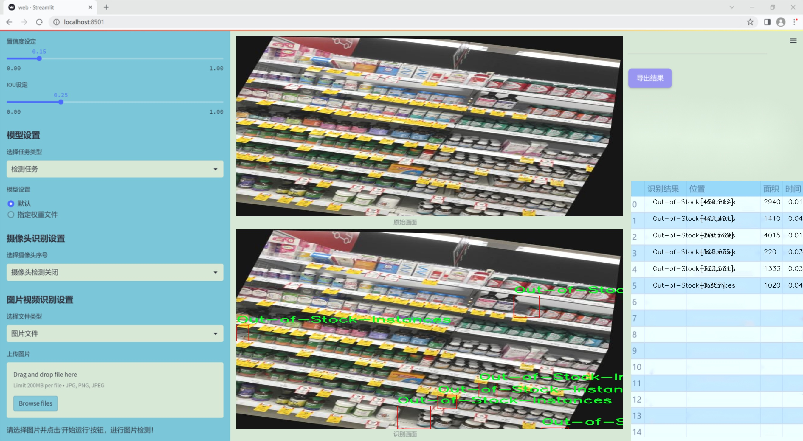
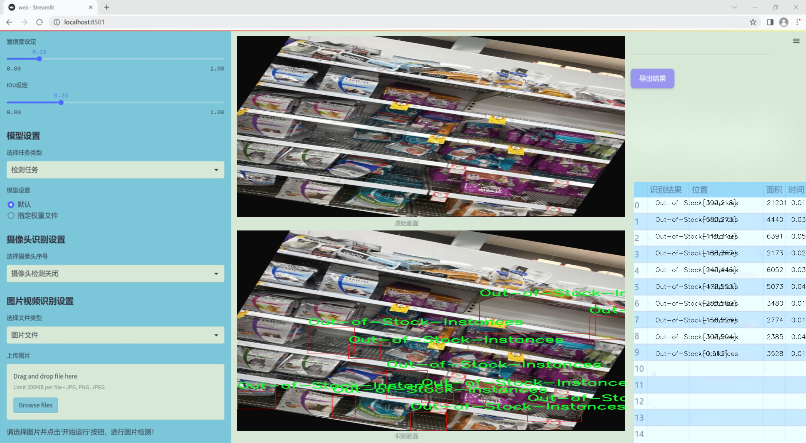
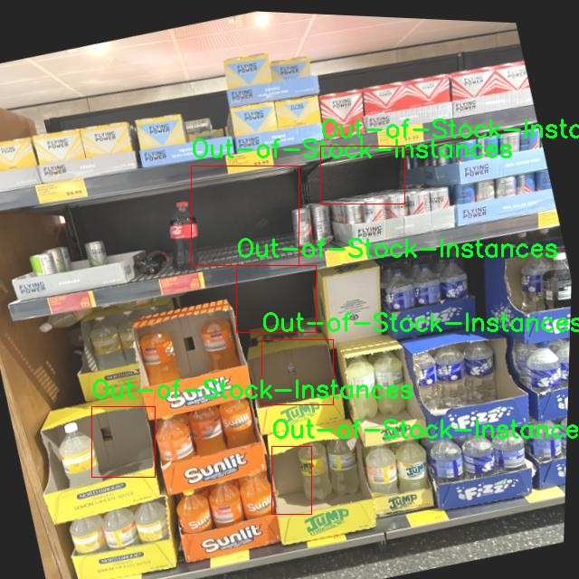
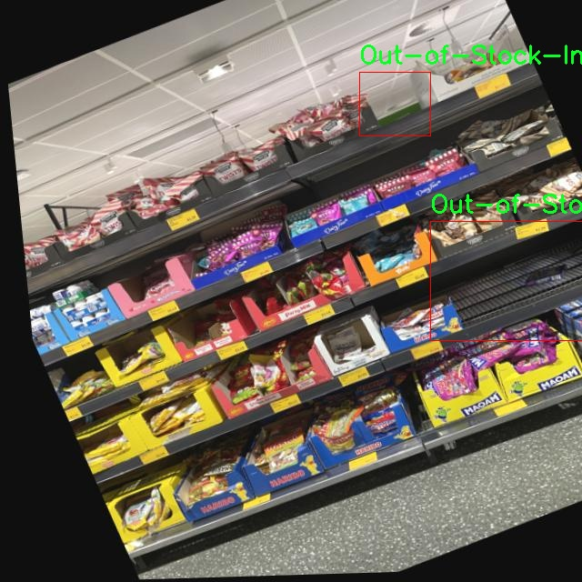
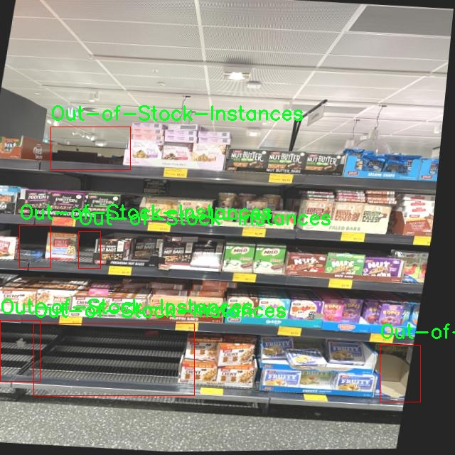
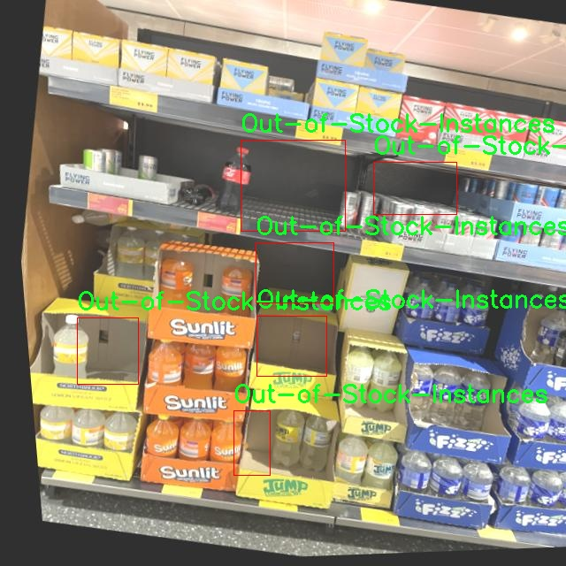
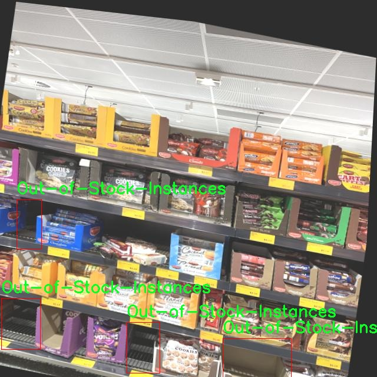

# 改进yolo11-DySnakeConv等200+全套创新点大全：货架空缺检测系统源码＆数据集全套

### 1.图片效果展示







##### 项目来源 **[人工智能促进会 2024.10.28](https://kdocs.cn/l/cszuIiCKVNis)**

注意：由于项目一直在更新迭代，上面“1.图片效果展示”和“2.视频效果展示”展示的系统图片或者视频可能为老版本，新版本在老版本的基础上升级如下：（实际效果以升级的新版本为准）

  （1）适配了YOLOV11的“目标检测”模型和“实例分割”模型，通过加载相应的权重（.pt）文件即可自适应加载模型。

  （2）支持“图片识别”、“视频识别”、“摄像头实时识别”三种识别模式。

  （3）支持“图片识别”、“视频识别”、“摄像头实时识别”三种识别结果保存导出，解决手动导出（容易卡顿出现爆内存）存在的问题，识别完自动保存结果并导出到tempDir中。

  （4）支持Web前端系统中的标题、背景图等自定义修改。

  另外本项目提供训练的数据集和训练教程,暂不提供权重文件（best.pt）,需要您按照教程进行训练后实现图片演示和Web前端界面演示的效果。

### 2.视频效果展示

[2.1 视频效果展示](https://www.bilibili.com/video/BV1rG15YcEcY/)

### 3.背景

研究背景与意义

在现代零售环境中，货架管理的有效性直接影响到消费者的购物体验和零售商的销售业绩。随着电子商务的迅猛发展，实体店面面临着前所未有的竞争压力，如何提升货架的商品可用性成为了零售商亟待解决的问题。货架空缺不仅导致消费者无法购买所需商品，还可能影响品牌形象和顾客忠诚度。因此，及时准确地检测货架空缺情况，对于零售商进行库存管理、优化补货策略具有重要意义。

近年来，计算机视觉技术的快速发展为货架空缺检测提供了新的解决方案。YOLO（You Only Look Once）系列模型因其高效的实时目标检测能力而受到广泛关注。YOLOv11作为该系列的最新版本，具备更强的特征提取能力和更快的处理速度，适合于复杂的零售环境中进行货架空缺检测。然而，现有的YOLOv11模型在特定应用场景下仍存在一定的局限性，尤其是在小样本数据集上表现不佳。因此，改进YOLOv11模型以适应货架空缺检测的需求显得尤为重要。

本研究基于141张图像的货架空缺检测数据集，旨在通过改进YOLOv11模型，提升其在实际应用中的检测精度和鲁棒性。通过引入数据增强技术、优化模型结构和调整训练策略，我们期望能够有效提高模型对货架空缺的识别能力。此外，本研究的成果不仅能够为零售商提供实时的货架监控解决方案，还能为后续的智能零售系统发展奠定基础，推动零售行业的数字化转型。

### 4.数据集信息展示

##### 4.1 本项目数据集详细数据（类别数＆类别名）

nc: 1
names: ['Out-of-Stock-Instances']


该项目为【目标检测】数据集，请在【训练教程和Web端加载模型教程（第三步）】这一步的时候按照【目标检测】部分的教程来训练

##### 4.2 本项目数据集信息介绍

本项目数据集信息介绍

本项目所使用的数据集名为“Empty Shelf Detector”，旨在为改进YOLOv11的货架空缺检测系统提供强有力的支持。该数据集专注于识别货架上的缺货情况，特别是针对“Out-of-Stock-Instances”这一类别进行深入分析。数据集中仅包含一个类别，旨在简化模型的训练过程，同时确保其在特定任务上的准确性和有效性。

“Empty Shelf Detector”数据集的构建过程涉及大量真实场景的图像采集，涵盖了多种零售环境下的货架布局。这些图像不仅展示了货架的不同角度和光照条件，还考虑了不同商品的摆放方式和货架的整体设计。通过多样化的样本，数据集确保了模型在实际应用中的鲁棒性和适应性。

在数据标注方面，所有图像均经过专业人员的仔细审核与标注，确保每个缺货实例都被准确识别。数据集中的图像标注不仅包括缺货商品的具体位置，还提供了相应的上下文信息，以帮助模型更好地理解货架的整体状态。这种细致的标注方式为后续的模型训练提供了丰富的训练样本，极大地提升了YOLOv11在货架空缺检测任务中的表现。

通过使用“Empty Shelf Detector”数据集，研究团队期望能够显著提高YOLOv11在实时货架监测中的检测精度和响应速度，为零售行业提供更为智能化的解决方案。该数据集的独特性和针对性使其成为本项目的核心组成部分，为实现高效的货架管理和库存监控奠定了坚实的基础。











### 5.全套项目环境部署视频教程（零基础手把手教学）

[5.1 所需软件PyCharm和Anaconda安装教程（第一步）](https://www.bilibili.com/video/BV1BoC1YCEKi/?spm_id_from=333.999.0.0&vd_source=bc9aec86d164b67a7004b996143742dc)


[5.2 安装Python虚拟环境创建和依赖库安装视频教程（第二步）](https://www.bilibili.com/video/BV1ZoC1YCEBw?spm_id_from=333.788.videopod.sections&vd_source=bc9aec86d164b67a7004b996143742dc)

### 6.改进YOLOv11训练教程和Web_UI前端加载模型教程（零基础手把手教学）

[6.1 改进YOLOv11训练教程和Web_UI前端加载模型教程（第三步）](https://www.bilibili.com/video/BV1BoC1YCEhR?spm_id_from=333.788.videopod.sections&vd_source=bc9aec86d164b67a7004b996143742dc)


按照上面的训练视频教程链接加载项目提供的数据集，运行train.py即可开始训练



     Epoch   gpu_mem       box       obj       cls    labels  img_size
     1/200     20.8G   0.01576   0.01955  0.007536        22      1280: 100%|██████████| 849/849 [14:42<00:00,  1.04s/it]
               Class     Images     Labels          P          R     mAP@.5 mAP@.5:.95: 100%|██████████| 213/213 [01:14<00:00,  2.87it/s]
                 all       3395      17314      0.994      0.957      0.0957      0.0843

     Epoch   gpu_mem       box       obj       cls    labels  img_size
     2/200     20.8G   0.01578   0.01923  0.007006        22      1280: 100%|██████████| 849/849 [14:44<00:00,  1.04s/it]
               Class     Images     Labels          P          R     mAP@.5 mAP@.5:.95: 100%|██████████| 213/213 [01:12<00:00,  2.95it/s]
                 all       3395      17314      0.996      0.956      0.0957      0.0845

     Epoch   gpu_mem       box       obj       cls    labels  img_size
     3/200     20.8G   0.01561    0.0191  0.006895        27      1280: 100%|██████████| 849/849 [10:56<00:00,  1.29it/s]
               Class     Images     Labels          P          R     mAP@.5 mAP@.5:.95: 100%|███████   | 187/213 [00:52<00:00,  4.04it/s]
                 all       3395      17314      0.996      0.957      0.0957      0.0845


###### [项目数据集下载链接](https://kdocs.cn/l/cszuIiCKVNis)

### 7.原始YOLOv11算法讲解


##### YOLO11介绍

Ultralytics YOLO11是一款尖端的、最先进的模型，它在之前YOLO版本成功的基础上进行了构建，并引入了新功能和改进，以进一步提升性能和灵活性。
**YOLO11设计快速、准确且易于使用，使其成为各种物体检测和跟踪、实例分割、图像分类以及姿态估计任务的绝佳选择。**


**结构图如下：**


##### **C3k2**

**C3k2，结构图如下**


**C3k2，继承自类`C2f，其中通过c3k设置False或者Ture来决定选择使用C3k还是`**Bottleneck


**实现代码** **ultralytics/nn/modules/block.py**

##### C2PSA介绍

**借鉴V10 PSA结构，实现了C2PSA和C2fPSA，最终选择了基于C2的C2PSA（可能涨点更好？）**


**实现代码** **ultralytics/nn/modules/block.py**

##### Detect介绍

**分类检测头引入了DWConv（更加轻量级，为后续二次创新提供了改进点），结构图如下（和V8的区别）：**


### 8.200+种全套改进YOLOV11创新点原理讲解

#### 8.1 200+种全套改进YOLOV11创新点原理讲解大全

由于篇幅限制，每个创新点的具体原理讲解就不全部展开，具体见下列网址中的改进模块对应项目的技术原理博客网址【Blog】（创新点均为模块化搭建，原理适配YOLOv5~YOLOv11等各种版本）

[改进模块技术原理博客【Blog】网址链接](https://gitee.com/qunmasj/good)


#### 8.2 精选部分改进YOLOV11创新点原理讲解

###### 这里节选部分改进创新点展开原理讲解(完整的改进原理见上图和[改进模块技术原理博客链接](https://gitee.com/qunmasj/good)【如果此小节的图加载失败可以通过CSDN或者Github搜索该博客的标题访问原始博客，原始博客图片显示正常】


### D-LKA Attention简介
自2010年代中期以来，卷积神经网络（CNNs）已成为许多计算机视觉应用的首选技术。它们能够从原始数据中自动提取复杂的特征表示，无需手动进行特征工程，这引起了医学图像分析社区的极大兴趣。许多成功的CNN架构，如U-Net、全卷积网络、DeepLab或SegCaps（分割胶囊），已经被开发出来。这些架构在语义分割任务中取得了巨大成功，先前的最新方法已经被超越。

在计算机视觉研究中，不同尺度下的目标识别是一个关键问题。在CNN中，可检测目标的大小与相应网络层的感受野尺寸密切相关。如果一个目标扩展到超出这个感受野的边界，这可能会导致欠分割结果。相反，与目标实际大小相比使用过大的感受野可能会限制识别，因为背景信息可能会对预测产生不必要的影响。

解决这个问题的一个有希望的方法涉及在并行使用具有不同尺寸的多个Kernel，类似于Inception块的机制。然而，由于参数和计算要求的指数增长，将Kernel大小增加以容纳更大的目标在实践中受到限制。因此，出现了各种策略，包括金字塔池化技术和不同尺度的扩张卷积，以捕获多尺度的上下文信息。

另一个直观的概念涉及将多尺度图像金字塔或它们的相关特征表示直接纳入网络架构。然而，这种方法存在挑战，特别是在管理训练和推理时间方面的可行性方面存在挑战。在这个背景下，使用编码器-解码器网络，如U-Net，已被证明是有利的。这样的网络在较浅的层中编码外观和位置，而在更深的层中，通过神经元的更广泛的感受野捕获更高的语义信息和上下文信息。

一些方法将来自不同层的特征组合在一起，或者预测来自不同尺寸的层的特征以使用多尺度的信息。此外，出现了从不同尺度的层中预测特征的方法，有效地实现了跨多个尺度的见解整合。然而，大多数编码器-解码器结构面临一个挑战：它们经常无法在不同尺度之间保持一致的特征，并主要使用最后一个解码器层生成分割结果。

语义分割是一项任务，涉及根据预定义的标签集为图像中的每个像素预测语义类别。这项任务要求提取高级特征同时保留初始的空间分辨率。CNNs非常适合捕获局部细节和低级信息，尽管以忽略全局上下文为代价。视觉Transformer（ViT）架构已经成为解决处理全局信息的视觉任务的关键，包括语义分割，取得了显著的成功。

ViT的基础是注意力机制，它有助于在整个输入序列上聚合信息。这种能力使网络能够合并远程的上下文提示，超越了CNN的有限感受野尺寸。然而，这种策略通常会限制ViT有效建模局部信息的能力。这种局限可能会妨碍它们检测局部纹理的能力，这对于各种诊断和预测任务至关重要。这种缺乏局部表示可以归因于ViT模型处理图像的特定方式。

ViT模型将图像分成一系列Patch，并使用自注意力机制来模拟它们之间的依赖关系。这种方法可能不如CNN模型中的卷积操作对感受野内提取局部特征有效。ViT和CNN模型之间的这种图像处理方法的差异可能解释了CNN模型在局部特征提取方面表现出色的原因。

近年来，已经开发出创新性方法来解决Transformer模型内部局部纹理不足的问题。其中一种方法是通过互补方法将CNN和ViT特征结合起来，以结合它们的优势并减轻局部表示的不足。TransUNet是这种方法的早期示例，它在CNN的瓶颈中集成了Transformer层，以模拟局部和全局依赖关系。HiFormer提出了一种解决方案，将Swin Transformer模块和基于CNN的编码器结合起来，生成两个多尺度特征表示，通过Double-Level Fusion模块集成。UNETR使用基于Transformer的编码器和CNN解码器进行3D医学图像分割。CoTr和TransBTS通过Transformer在低分辨率阶段增强分割性能，将CNN编码器和解码器连接在一起。

增强局部特征表示的另一种策略是重新设计纯Transformer模型内部的自注意力机制。在这方面，Swin-Unet在U形结构中集成了一个具有线性计算复杂性的Swin Transformer块作为多尺度 Backbone 。MISSFormer采用高效Transformer来解决视觉Transformer中的参数问题，通过在输入块上进行不可逆的降采样操作。D-Former引入了一个纯Transformer的管道，具有双重注意模块，以分段的方式捕获细粒度的局部注意和与多元单元的交互。然而，仍然存在一些特定的限制，包括计算效率低下，如TransUNet模型所示，对CNN Backbone 的严重依赖，如HiFormer所观察到的，以及对多尺度信息的忽略。

此外，目前的分割架构通常采用逐层处理3D输入 volumetric 的方法，无意中忽视了相邻切片之间的潜在相关性。这一疏忽限制了对 volumetric 信息的全面利用，因此损害了定位精度和上下文集成。此外，必须认识到，医学领域的病变通常在形状上发生变形。因此，用于医学图像分析的任何学习算法都必须具备捕捉和理解这些变形的能力。与此同时，该算法应保持计算效率，以便处理3D volumetric数据。

为了解决上述提到的挑战，作者提出了一个解决方案，即可变形大卷积核注意力模块（Deformable LKA module），它是作者网络设计的基本构建模块。这个模块明确设计成在有效处理上下文信息的同时保留局部描述符。作者的架构在这两个方面的平衡增强了实现精确语义分割的能力。

值得注意的是，参考该博客引入了一种基于数据的感受野的动态适应，不同于传统卷积操作中的固定滤波器Mask。这种自适应方法使作者能够克服与静态方法相关的固有限制。这种创新方法还扩展到了D-LKA Net架构的2D和3D版本的开发。

在3D模型的情况下，D-LKA机制被量身定制以适应3D环境，从而实现在不同 volumetric 切片之间无缝信息交互。最后，作者的贡献通过其计算效率得到进一步强调。作者通过仅依靠D-LKA概念的设计来实现这一点，在各种分割基准上取得了显著的性能，确立了作者的方法作为一种新的SOTA方法。

在本节中，作者首先概述方法论。首先，作者回顾了由Guo等人引入的大卷积核注意力（Large Kernel Attention，LKA）的概念。然后，作者介绍了作者对可变形LKA模块的创新探索。在此基础上，作者介绍了用于分割任务的2D和3D网络架构。

大卷积核提供了与自注意力机制类似的感受野。可以通过使用深度卷积、深度可扩展卷积和卷积来构建大卷积核，从而减少了参数和计算量。构建输入维度为和通道数的卷积核的深度卷积和深度可扩展卷积的卷积核大小的方程如下：


具有卷积核大小和膨胀率。参数数量和浮点运算（FLOPs）的计算如下：


FLOPs的数量与输入图像的大小成线性增长。参数的数量随通道数和卷积核大小的增加而呈二次增长。然而，由于它们通常都很小，因此它们不是限制因素。

为了最小化对于固定卷积核大小K的参数数量，可以将方程3对于膨胀率的导数设定为零：


例如，当卷积核大小为时，结果是。将这些公式扩展到3D情况是直接的。对于大小为和通道数C的输入，3D情况下参数数量和FLOPs 的方程如下：


具有卷积核大小和膨胀。


利用大卷积核进行医学图像分割的概念通过引入可变形卷积得以扩展。可变形卷积可以通过整数偏移自由调整采样网格以进行自由变形。额外的卷积层从特征图中学习出变形，从而创建一个偏移场。基于特征本身学习变形会导致自适应卷积核。这种灵活的卷积核形状可以提高病变或器官变形的表示，从而增强了目标边界的定义。

负责计算偏移的卷积层遵循其相应卷积层的卷积核大小和膨胀。双线性插值用于计算不在图像网格上的偏移的像素值。如图2所示，D-LKA模块可以表示为：


其中输入特征由表示，。表示为注意力图，其中每个值表示相应特征的相对重要性。运算符  表示逐元素乘法运算。值得注意的是，LKA不同于传统的注意力方法，它不需要额外的规范化函数，如或。这些规范化函数往往忽视高频信息，从而降低了基于自注意力的方法的性能。

在该方法的2D版本中，卷积层被可变形卷积所替代，因为可变形卷积能够改善对具有不规则形状和大小的目标的捕捉能力。这些目标在医学图像数据中常常出现，因此这种增强尤为重要。

然而，将可变形LKA的概念扩展到3D领域会带来一定的挑战。主要的约束来自于需要用于生成偏移的额外卷积层。与2D情况不同，由于输入和输出通道的性质，这一层无法以深度可分的方式执行。在3D环境中，输入通道对应于特征，而输出通道扩展到，其中是卷积核的大小。大卷积核的复杂性导致沿第3D的通道数扩展，导致参数和FLOPs大幅增加。因此，针对3D情况采用了另一种替代方法。在现有的LKA框架中，深度卷积之后引入了一个单独的可变形卷积层。这种战略性的设计调整旨在减轻扩展到3D领域所带来的挑战。


2D网络的架构如图1所示。第一变种使用MaxViT作为编码器组件，用于高效特征提取，而第二变种则结合可变形LKA层进行更精细、卓越的分割。

在更正式的描述中，编码器生成4个分层输出表示。首先，卷积干扰将输入图像的维度减小到。随后，通过4个MaxViT块的4个阶段进行特征提取，每个阶段后跟随降采样层。随着过程进展到解码器，实施了4个阶段的D-LKA层，每个阶段包含2个D-LKA块。然后，应用Patch扩展层以实现分辨率上采样，同时减小通道维度。最后，线性层负责生成最终的输出。

2D D-LKA块的结构包括LayerNorm、可变形LKA和多层感知器（MLP）。积分残差连接确保了有效的特征传播，即使在更深层也是如此。这个安排可以用数学方式表示为：


其中输入特征，层归一化LN，可变形LKA注意力，深度卷积，线性层和GeLU激活函数。

3D网络架构如图1所示，采用编码器-解码器设计进行分层结构化。首先，一个Patch嵌入层将输入图像的维度从（）减小到（）。在编码器中，采用了3个D-LKA阶段的序列，每个阶段包含3个D-LKA块。在每个阶段之后，通过降采样步骤将空间分辨率减半，同时将通道维度加倍。中央瓶颈包括另一组2个D-LKA块。解码器结构与编码器相对称。

为了将特征分辨率加倍，同时减少通道数，使用转置卷积。每个解码器阶段都使用3个D-LKA块来促进远距离特征依赖性。最终的分割输出由一个卷积层产生，后面跟随一个卷积层以匹配特定类别的通道要求。

为了建立输入图像和分割输出之间的直接连接，使用卷积形成了一个跳跃连接。额外的跳跃连接根据简单的加法对来自其他阶段的特征进行融合。最终的分割图是通过和卷积层的组合产生的。

3D D-LKA块包括层归一化，后跟D-LKA注意力，应用了残差连接的部分。随后的部分采用了一个卷积层，后面跟随一个卷积层，两者都伴随着残差连接。这个整个过程可以总结如下：


带有输入特征 、层归一化 、可变形 LKA 、卷积层 和输出特征 的公式。是指一个前馈网络，包括2个卷积层和激活函数。

表7显示了普通卷积和构建卷积的参数数量比较。尽管标准卷积的参数数量在通道数较多时急剧增加，但分解卷积的参数总体较低，并且增长速度不那么快。

与分解卷积相比，可变形分解卷积增加了大量参数，但仍然明显小于标准卷积。可变形卷积的主要参数是由偏移网络创建的。在这里，作者假设可变形深度卷积的Kernel大小为（5,5），可变形深度空洞卷积的Kernel大小为（7,7）。这导致了21×21大小的大Kernel的最佳参数数量。更高效地生成偏移量的方法将大大减少参数数量。


值得注意的是，引入可变形LKA确实会增加模型的参数数量和每秒的浮点运算次数（FLOPS）。然而，重要的是强调，这增加的计算负载不会影响作者模型的整体推理速度。

相反，对于Batch-size > 1，作者甚至观察到推理时间的减少，如图7所示。例如，基于作者的广泛实验，作者观察到对于Batch-size为16，具有可变形卷积和没有可变形卷积的推理时间分别为8.01毫秒和17.38毫秒。作者认为这是由于在2D中对可变形卷积的高效实现所致。为了测量时间，使用了大小为（）的随机输入。在GPU热身周期50次迭代之后，网络被推断了1000次。测量是在NVIDIA RTX 3090 GPU上进行的。


为了充分利用性能与参数之间的权衡关系，作者在图8中可视化了在Synapse 2D数据集上报告的DSC和HD性能以及基于参数数量的内存消耗。D-LKA Net引入了相当多的参数，约为101M。这比性能第二好的方法ScaleFormer使用的111.6M参数要少。

与更轻量级的DAEFormer模型相比，作者实现了更好的性能，这证明了参数增加的合理性。大多数参数来自于MaxViT编码器；因此，将编码器替换为更高效的编码器可以减少模型参数。值得注意的是，在此可视化中，作者最初将HD和内存值都归一化到[0, 100]范围内。随后，作者将它们从100缩小，以增强更高值的表示。


### 9.系统功能展示

图9.1.系统支持检测结果表格显示

  图9.2.系统支持置信度和IOU阈值手动调节

  图9.3.系统支持自定义加载权重文件best.pt(需要你通过步骤5中训练获得)

  图9.4.系统支持摄像头实时识别

  图9.5.系统支持图片识别

  图9.6.系统支持视频识别

  图9.7.系统支持识别结果文件自动保存

  图9.8.系统支持Excel导出检测结果数据


### 10. YOLOv11核心改进源码讲解

#### 10.1 mamba_yolo.py

以下是经过简化和注释的核心代码部分：

```python
import torch
import torch.nn as nn
from einops import rearrange

class LayerNorm2d(nn.Module):
    """自定义的二维层归一化类"""
    def __init__(self, normalized_shape, eps=1e-6, elementwise_affine=True):
        super().__init__()
        self.norm = nn.LayerNorm(normalized_shape, eps, elementwise_affine)

    def forward(self, x):
        # 将输入张量从 (B, C, H, W) 转换为 (B, H, W, C)
        x = rearrange(x, 'b c h w -> b h w c').contiguous()
        x = self.norm(x)  # 应用层归一化
        # 再将张量转换回 (B, C, H, W)
        x = rearrange(x, 'b h w c -> b c h w').contiguous()
        return x

class CrossScan(torch.autograd.Function):
    """交叉扫描操作的自定义函数"""
    @staticmethod
    def forward(ctx, x: torch.Tensor):
        B, C, H, W = x.shape
        ctx.shape = (B, C, H, W)
        xs = x.new_empty((B, 4, C, H * W))  # 创建新的张量
        xs[:, 0] = x.flatten(2, 3)  # 展平 H 和 W 维度
        xs[:, 1] = x.transpose(dim0=2, dim1=3).flatten(2, 3)  # 转置并展平
        xs[:, 2:4] = torch.flip(xs[:, 0:2], dims=[-1])  # 翻转
        return xs

    @staticmethod
    def backward(ctx, ys: torch.Tensor):
        B, C, H, W = ctx.shape
        L = H * W
        # 反向传播计算
        ys = ys[:, 0:2] + ys[:, 2:4].flip(dims=[-1]).view(B, 2, -1, L)
        y = ys[:, 0] + ys[:, 1].view(B, -1, W, H).transpose(dim0=2, dim1=3).contiguous().view(B, -1, L)
        return y.view(B, -1, H, W)

class SelectiveScanCore(torch.autograd.Function):
    """选择性扫描的核心操作"""
    @staticmethod
    @torch.cuda.amp.custom_fwd
    def forward(ctx, u, delta, A, B, C, D=None, delta_bias=None, delta_softplus=False, nrows=1, backnrows=1):
        # 确保输入张量是连续的
        if u.stride(-1) != 1:
            u = u.contiguous()
        if delta.stride(-1) != 1:
            delta = delta.contiguous()
        if D is not None and D.stride(-1) != 1:
            D = D.contiguous()
        if B.stride(-1) != 1:
            B = B.contiguous()
        if C.stride(-1) != 1:
            C = C.contiguous()
        
        # 进行选择性扫描的前向计算
        out, x, *rest = selective_scan_cuda_core.fwd(u, delta, A, B, C, D, delta_bias, delta_softplus, 1)
        ctx.save_for_backward(u, delta, A, B, C, D, delta_bias, x)  # 保存反向传播需要的张量
        return out

    @staticmethod
    @torch.cuda.amp.custom_bwd
    def backward(ctx, dout):
        u, delta, A, B, C, D, delta_bias, x = ctx.saved_tensors
        # 进行选择性扫描的反向计算
        du, ddelta, dA, dB, dC, dD, ddelta_bias, *rest = selective_scan_cuda_core.bwd(
            u, delta, A, B, C, D, delta_bias, dout, x, ctx.delta_softplus, 1
        )
        return (du, ddelta, dA, dB, dC, dD, ddelta_bias, None, None, None, None)

class SS2D(nn.Module):
    """选择性扫描的二维实现"""
    def __init__(self, d_model=96, d_state=16, ssm_ratio=2.0, act_layer=nn.SiLU, dropout=0.0):
        super().__init__()
        self.in_proj = nn.Conv2d(d_model, d_model * ssm_ratio, kernel_size=1)  # 输入投影
        self.out_proj = nn.Conv2d(d_model * ssm_ratio, d_model, kernel_size=1)  # 输出投影
        self.act = act_layer()  # 激活函数
        self.dropout = nn.Dropout(dropout)  # Dropout层

    def forward(self, x: torch.Tensor):
        x = self.in_proj(x)  # 输入投影
        x = self.act(x)  # 激活
        x = self.dropout(x)  # Dropout
        x = self.out_proj(x)  # 输出投影
        return x

class VSSBlock_YOLO(nn.Module):
    """YOLO模型中的选择性扫描块"""
    def __init__(self, in_channels: int, hidden_dim: int, drop_path: float):
        super().__init__()
        self.proj_conv = nn.Conv2d(in_channels, hidden_dim, kernel_size=1)  # 投影卷积
        self.ss2d = SS2D(d_model=hidden_dim)  # 选择性扫描层
        self.drop_path = nn.Dropout(drop_path)  # DropPath层

    def forward(self, input: torch.Tensor):
        input = self.proj_conv(input)  # 投影
        x = self.ss2d(input)  # 选择性扫描
        x = self.drop_path(x)  # DropPath
        return x
```

### 代码分析与注释
1. **LayerNorm2d**: 自定义的二维层归一化模块，输入为四维张量，进行归一化处理。
2. **CrossScan**: 实现交叉扫描的前向和反向传播，主要用于对输入张量进行不同方向的处理。
3. **SelectiveScanCore**: 选择性扫描的核心操作，包含前向和反向传播的实现，使用CUDA加速。
4. **SS2D**: 选择性扫描的二维实现，包含输入和输出的卷积投影，以及激活和Dropout层。
5. **VSSBlock_YOLO**: YOLO模型中的选择性扫描块，负责对输入进行投影和选择性扫描处理。

以上代码是模型的核心部分，其他部分如辅助函数和模块可以根据需要进行扩展和使用。

这个程序文件 `mamba_yolo.py` 实现了一个基于深度学习的视觉模型，主要用于目标检测任务，采用了 YOLO（You Only Look Once）系列的结构。文件中定义了多个类和函数，构成了整个模型的框架。以下是对代码的逐部分分析和说明。

首先，文件引入了一些必要的库，包括 `torch`、`math`、`functools` 和 `torch.nn` 等。它还使用了 `einops` 库来处理张量的重排，以及 `timm` 库中的 `DropPath` 层来实现随机深度丢弃。

接下来，定义了一个 `LayerNorm2d` 类，继承自 `nn.Module`，用于实现二维层归一化。它在前向传播中对输入张量进行形状重排，以适应 `LayerNorm` 的要求。

`autopad` 函数用于自动计算卷积操作的填充，使得输出形状与输入形状相同。它根据给定的卷积核大小和膨胀因子来确定填充大小。

然后，定义了 `CrossScan` 和 `CrossMerge` 类，这两个类分别实现了交叉扫描和交叉合并的功能，主要用于在模型中处理输入特征图的交叉信息。

`SelectiveScanCore` 类实现了选择性扫描的核心功能，利用 CUDA 加速进行前向和反向传播。选择性扫描是一种用于高效处理序列数据的技术，能够在计算中保持较低的复杂度。

`cross_selective_scan` 函数是一个封装函数，调用 `SelectiveScanCore` 进行选择性扫描，并处理输入的各种参数和张量。它支持多种输出归一化方式。

`SS2D` 类是一个核心模块，包含了多种参数和层，主要用于实现选择性扫描的功能。它的构造函数中定义了输入和输出的投影层、卷积层以及其他相关参数。

`RGBlock` 和 `LSBlock` 类分别实现了不同的模块，前者包含了全连接层和深度卷积层，后者则使用了批归一化和激活函数。

`XSSBlock` 类是一个复杂的模块，结合了多个子模块，使用选择性扫描和其他操作来处理输入特征图。它的前向传播方法通过多个步骤处理输入，并结合残差连接。

`VSSBlock_YOLO` 类是 YOLO 模型的一个具体实现，包含了选择性扫描模块和其他必要的层。它的前向传播方法整合了输入的特征图，并通过不同的分支进行处理。

`SimpleStem` 类实现了模型的初始卷积层，用于处理输入图像并生成特征图。它使用了两个卷积层和激活函数。

最后，`VisionClueMerge` 类用于合并不同来源的特征图，以便在后续的处理步骤中使用。

整体来看，这个文件实现了一个复杂的视觉模型，结合了选择性扫描、卷积操作和多种激活函数，旨在提高目标检测的性能和效率。模型的设计考虑了多种因素，包括参数的初始化、前向传播的效率以及不同模块之间的连接方式。

#### 10.2 CTrans.py

以下是代码中最核心的部分，并附上详细的中文注释：

```python
import torch
import torch.nn as nn
import numpy as np
from torch.nn import Dropout, Softmax, LayerNorm

class Channel_Embeddings(nn.Module):
    """构建通道嵌入，包括位置嵌入和补丁嵌入。"""
    def __init__(self, patchsize, img_size, in_channels):
        super().__init__()
        img_size = (img_size, img_size)  # 将图像大小转换为元组
        patch_size = (patchsize, patchsize)  # 将补丁大小转换为元组
        n_patches = (img_size[0] // patch_size[0]) * (img_size[1] // patch_size[1])  # 计算补丁数量

        # 使用最大池化和卷积层来提取补丁嵌入
        self.patch_embeddings = nn.Sequential(
            nn.MaxPool2d(kernel_size=5, stride=5),
            nn.Conv2d(in_channels=in_channels,
                      out_channels=in_channels,
                      kernel_size=patchsize // 5,
                      stride=patchsize // 5)
        )

        # 初始化位置嵌入
        self.position_embeddings = nn.Parameter(torch.zeros(1, n_patches, in_channels))
        self.dropout = Dropout(0.1)  # Dropout层以防止过拟合

    def forward(self, x):
        """前向传播，计算嵌入。"""
        if x is None:
            return None
        x = self.patch_embeddings(x)  # 提取补丁嵌入
        x = x.flatten(2)  # 将特征展平
        x = x.transpose(-1, -2)  # 转置以适应位置嵌入
        embeddings = x + self.position_embeddings  # 添加位置嵌入
        embeddings = self.dropout(embeddings)  # 应用Dropout
        return embeddings

class Attention_org(nn.Module):
    """实现多头注意力机制。"""
    def __init__(self, vis, channel_num):
        super(Attention_org, self).__init__()
        self.vis = vis  # 可视化标志
        self.KV_size = sum(channel_num)  # 键值对的大小
        self.channel_num = channel_num  # 通道数量
        self.num_attention_heads = 4  # 注意力头的数量

        # 初始化查询、键、值的线性变换
        self.query = nn.ModuleList([nn.Linear(c, c, bias=False) for c in channel_num])
        self.key = nn.Linear(self.KV_size, self.KV_size, bias=False)
        self.value = nn.Linear(self.KV_size, self.KV_size, bias=False)
        self.softmax = Softmax(dim=3)  # Softmax层
        self.attn_dropout = Dropout(0.1)  # Dropout层
        self.proj_dropout = Dropout(0.1)  # Dropout层

    def forward(self, *embeddings):
        """前向传播，计算注意力输出。"""
        multi_head_Q = [query(emb) for query, emb in zip(self.query, embeddings) if emb is not None]
        multi_head_K = self.key(torch.cat(embeddings, dim=2))  # 将所有嵌入拼接
        multi_head_V = self.value(torch.cat(embeddings, dim=2))  # 将所有嵌入拼接

        # 计算注意力分数
        attention_scores = [torch.matmul(Q, multi_head_K) / np.sqrt(self.KV_size) for Q in multi_head_Q]
        attention_probs = [self.softmax(score) for score in attention_scores]  # 计算注意力概率

        # 应用Dropout
        attention_probs = [self.attn_dropout(prob) for prob in attention_probs]
        context_layers = [torch.matmul(prob, multi_head_V) for prob in attention_probs]  # 计算上下文层

        # 返回输出和注意力权重
        outputs = [self.proj_dropout(layer) for layer in context_layers]
        return outputs

class ChannelTransformer(nn.Module):
    """通道变换器，整合多个嵌入并进行编码。"""
    def __init__(self, channel_num=[64, 128, 256, 512], img_size=640, vis=False, patchSize=[40, 20, 10, 5]):
        super().__init__()
        self.embeddings = nn.ModuleList([Channel_Embeddings(patch, img_size // (2 ** i), c) 
                                          for i, (patch, c) in enumerate(zip(patchSize, channel_num))])
        self.encoder = Encoder(vis, channel_num)  # 编码器
        self.reconstruct = nn.ModuleList([Reconstruct(c, c, kernel_size=1, scale_factor=(patch, patch)) 
                                           for patch, c in zip(patchSize, channel_num)])

    def forward(self, en):
        """前向传播，计算最终输出。"""
        embeddings = [embed(en[i]) for i, embed in enumerate(self.embeddings) if en[i] is not None]
        encoded = self.encoder(*embeddings)  # 编码
        reconstructed = [recon(enc) + en[i] for i, (recon, enc) in enumerate(zip(self.reconstruct, encoded)) if en[i] is not None]
        return reconstructed

class GetIndexOutput(nn.Module):
    """获取特定索引的输出。"""
    def __init__(self, index):
        super().__init__()
        self.index = index

    def forward(self, x):
        """返回指定索引的输出。"""
        return x[self.index]
```

### 代码说明：
1. **Channel_Embeddings**：构建通道嵌入，包含补丁嵌入和位置嵌入，使用卷积和池化层提取特征。
2. **Attention_org**：实现多头注意力机制，计算注意力分数和上下文层，支持可视化。
3. **ChannelTransformer**：整合多个嵌入，进行编码和重构，返回最终输出。
4. **GetIndexOutput**：根据指定索引获取输出。

以上是代码的核心部分和详细注释，帮助理解其功能和实现方式。

这个程序文件 `CTrans.py` 实现了一个基于通道的变换器（Channel Transformer），主要用于图像处理任务。程序中定义了多个类，每个类负责不同的功能，整体结构体现了深度学习中常见的模块化设计。

首先，文件导入了一些必要的库，包括 PyTorch 及其模块，NumPy，以及其他用于深度学习的工具。接下来，定义了几个主要的类。

`Channel_Embeddings` 类用于构建图像的嵌入表示。它通过最大池化和卷积操作将输入图像分割成多个小块（patch），并为每个小块生成位置嵌入。该类的 `forward` 方法接收输入图像并返回经过处理的嵌入。

`Reconstruct` 类则负责将嵌入的特征图重建为原始图像的大小。它使用卷积和批归一化层来处理输入的嵌入，并通过上采样将其恢复到更高的分辨率。

`Attention_org` 类实现了多头注意力机制。它将输入的嵌入通过线性变换生成查询（Query）、键（Key）和值（Value），并计算注意力分数。注意力分数经过归一化后用于加权求和，生成上下文向量。该类的 `forward` 方法处理多个输入嵌入，并返回加权后的输出。

`Mlp` 类定义了一个简单的多层感知机（MLP），用于对嵌入进行进一步的非线性变换。它包含两个全连接层和一个激活函数（GELU），并在每层后应用 dropout。

`Block_ViT` 类实现了一个变换器块，包含了注意力机制和前馈网络。它首先对输入的嵌入进行层归一化，然后通过注意力层和前馈网络进行处理，最后将结果与原始输入相加以实现残差连接。

`Encoder` 类由多个 `Block_ViT` 组成，负责对输入的嵌入进行多次处理。它同样实现了层归一化，并在每个块的输出中收集注意力权重。

`ChannelTransformer` 类是整个模型的核心，负责将输入的多个通道（图像）进行嵌入、编码和重建。它通过多个 `Channel_Embeddings` 和 `Reconstruct` 实例来处理不同通道的输入，并将编码后的特征进行重建。

最后，`GetIndexOutput` 类用于从模型的输出中提取特定索引的结果，方便后续处理。

整体来看，这个程序实现了一个复杂的深度学习模型，结合了卷积神经网络和变换器的优点，适用于图像特征提取和重建任务。每个模块的设计都考虑到了深度学习中的常见操作，如注意力机制、残差连接和层归一化等，使得模型在处理复杂任务时能够保持良好的性能。

#### 10.3 kagn_conv.py

以下是代码中最核心的部分，并附上详细的中文注释：

```python
import torch
import torch.nn as nn
from functools import lru_cache

class KAGNConvNDLayer(nn.Module):
    def __init__(self, conv_class, norm_class, conv_w_fun, input_dim, output_dim, degree, kernel_size,
                 groups=1, padding=0, stride=1, dilation=1, dropout: float = 0.0, ndim: int = 2):
        super(KAGNConvNDLayer, self).__init__()
        # 初始化输入和输出维度、卷积参数等
        self.inputdim = input_dim
        self.outdim = output_dim
        self.degree = degree
        self.kernel_size = kernel_size
        self.padding = padding
        self.stride = stride
        self.dilation = dilation
        self.groups = groups
        self.base_activation = nn.SiLU()  # 使用SiLU激活函数
        self.conv_w_fun = conv_w_fun  # 卷积权重函数
        self.ndim = ndim  # 数据的维度
        self.dropout = None  # 初始化dropout层

        # 根据维度选择合适的dropout层
        if dropout > 0:
            if ndim == 1:
                self.dropout = nn.Dropout1d(p=dropout)
            elif ndim == 2:
                self.dropout = nn.Dropout2d(p=dropout)
            elif ndim == 3:
                self.dropout = nn.Dropout3d(p=dropout)

        # 检查groups参数的有效性
        if groups <= 0:
            raise ValueError('groups must be a positive integer')
        if input_dim % groups != 0:
            raise ValueError('input_dim must be divisible by groups')
        if output_dim % groups != 0:
            raise ValueError('output_dim must be divisible by groups')

        # 创建卷积层和归一化层
        self.base_conv = nn.ModuleList([conv_class(input_dim // groups,
                                                   output_dim // groups,
                                                   kernel_size,
                                                   stride,
                                                   padding,
                                                   dilation,
                                                   groups=1,
                                                   bias=False) for _ in range(groups)])

        self.layer_norm = nn.ModuleList([norm_class(output_dim // groups) for _ in range(groups)])

        # 初始化多项式权重
        poly_shape = (groups, output_dim // groups, (input_dim // groups) * (degree + 1)) + tuple(
            kernel_size for _ in range(ndim))
        self.poly_weights = nn.Parameter(torch.randn(*poly_shape))  # 多项式权重
        self.beta_weights = nn.Parameter(torch.zeros(degree + 1, dtype=torch.float32))  # beta权重

        # 使用Kaiming均匀分布初始化卷积层权重
        for conv_layer in self.base_conv:
            nn.init.kaiming_uniform_(conv_layer.weight, nonlinearity='linear')

        nn.init.kaiming_uniform_(self.poly_weights, nonlinearity='linear')
        nn.init.normal_(
            self.beta_weights,
            mean=0.0,
            std=1.0 / ((kernel_size ** ndim) * self.inputdim * (self.degree + 1.0)),
        )

    def beta(self, n, m):
        # 计算beta值
        return (
            ((m + n) * (m - n) * n ** 2) / (m ** 2 / (4.0 * n ** 2 - 1.0))
        ) * self.beta_weights[n]

    @lru_cache(maxsize=128)  # 使用缓存避免重复计算Legendre多项式
    def gram_poly(self, x, degree):
        # 计算Legendre多项式
        p0 = x.new_ones(x.size())  # p0初始化为1

        if degree == 0:
            return p0.unsqueeze(-1)

        p1 = x  # p1初始化为x
        grams_basis = [p0, p1]  # 存储多项式基

        for i in range(2, degree + 1):
            p2 = x * p1 - self.beta(i - 1, i) * p0  # 递归计算多项式
            grams_basis.append(p2)
            p0, p1 = p1, p2  # 更新p0和p1

        return torch.cat(grams_basis, dim=1)  # 合并多项式基

    def forward_kag(self, x, group_index):
        # 前向传播过程
        basis = self.base_conv[group_index](self.base_activation(x))  # 通过基本卷积层计算基础输出

        x = torch.tanh(x).contiguous()  # 对输入进行tanh归一化

        if self.dropout is not None:
            x = self.dropout(x)  # 应用dropout

        grams_basis = self.base_activation(self.gram_poly(x, self.degree))  # 计算多项式基
        y = self.conv_w_fun(grams_basis, self.poly_weights[group_index],
                            stride=self.stride, dilation=self.dilation,
                            padding=self.padding, groups=1)  # 计算卷积输出

        y = self.base_activation(self.layer_norm[group_index](y + basis))  # 归一化并激活

        return y

    def forward(self, x):
        # 整体前向传播
        split_x = torch.split(x, self.inputdim // self.groups, dim=1)  # 按组分割输入
        output = []
        for group_ind, _x in enumerate(split_x):
            y = self.forward_kag(_x.clone(), group_ind)  # 对每组进行前向传播
            output.append(y.clone())
        y = torch.cat(output, dim=1)  # 合并输出
        return y
```

### 代码核心部分说明：
1. **KAGNConvNDLayer类**：这是一个自定义的卷积层，支持多维卷积操作。它使用了基于Legendre多项式的卷积方法，并且支持不同的归一化和激活函数。
2. **初始化方法**：在初始化时设置了输入输出维度、卷积参数、dropout等，并且创建了多个卷积层和归一化层。
3. **beta和gram_poly方法**：这两个方法用于计算Legendre多项式的相关值，`gram_poly`方法使用了缓存以提高效率。
4. **forward_kag方法**：实现了前向传播的具体逻辑，计算基础卷积输出和多项式基的卷积输出，并进行归一化和激活。
5. **forward方法**：处理输入数据的整体前向传播，将输入按组分割并调用`forward_kag`进行处理，最后合并输出。

这个类的设计使得它能够灵活地处理不同维度的卷积操作，并且通过多项式权重的学习增强了模型的表达能力。

这个程序文件 `kagn_conv.py` 定义了一个名为 `KAGNConvNDLayer` 的神经网络层，以及其一维、二维和三维的特定实现。该层的设计灵感来源于一种特殊的卷积结构，旨在通过引入多项式基函数来增强卷积操作的表达能力。

首先，`KAGNConvNDLayer` 类是一个通用的卷积层，支持任意维度的卷积操作。它的构造函数接受多个参数，包括输入和输出维度、卷积核大小、分组数、填充、步幅、扩张率、丢弃率等。构造函数中还定义了基本的激活函数（使用 SiLU 激活函数），并根据输入的维度选择相应的丢弃层（Dropout）。在参数检查中，确保分组数是正整数，并且输入和输出维度能够被分组数整除。

该类还定义了基础卷积层和归一化层，使用 `nn.ModuleList` 来管理这些层。多项式权重 `poly_weights` 和 `beta_weights` 被定义为可学习的参数，并使用 Kaiming 均匀分布进行初始化，以提高训练的稳定性。

`beta` 方法用于计算与 Legendre 多项式相关的系数，而 `gram_poly` 方法则计算给定输入和多项式的度数的 Gram 多项式。为了避免重复计算，`gram_poly` 方法使用了 LRU 缓存。

在 `forward_kag` 方法中，首先对输入应用基本激活函数，然后进行线性变换。接着，将输入标准化到 [-1, 1] 的范围，以便于计算 Legendre 多项式。之后，计算 Gram 基，并使用传入的卷积函数和多项式权重进行卷积操作，最后进行归一化和激活。

`forward` 方法将输入分割成多个组，并对每个组调用 `forward_kag` 方法，最后将所有组的输出拼接在一起。

接下来的三个类 `KAGNConv3DLayer`、`KAGNConv2DLayer` 和 `KAGNConv1DLayer` 分别是 `KAGNConvNDLayer` 的具体实现，针对三维、二维和一维卷积进行了相应的封装。这些类通过调用父类的构造函数，传入适当的卷积类和归一化类，简化了多维卷积层的创建过程。

整体来看，这个文件实现了一个灵活且强大的卷积层，能够处理不同维度的数据，并通过多项式基函数增强了卷积操作的能力。

#### 10.4 val.py

以下是经过简化和注释的核心代码部分，主要集中在 `DetectionValidator` 类的关键功能上：

```python
import os
import torch
from ultralytics.utils import LOGGER, ops
from ultralytics.utils.metrics import DetMetrics, box_iou
from ultralytics.utils.plotting import output_to_target, plot_images

class DetectionValidator:
    """
    用于基于检测模型的验证的类。
    """

    def __init__(self, dataloader=None, save_dir=None, args=None):
        """初始化检测模型所需的变量和设置。"""
        self.dataloader = dataloader  # 数据加载器
        self.save_dir = save_dir  # 保存目录
        self.args = args  # 参数
        self.metrics = DetMetrics(save_dir=self.save_dir)  # 初始化检测指标
        self.iouv = torch.linspace(0.5, 0.95, 10)  # 用于计算mAP的IoU阈值
        self.niou = self.iouv.numel()  # IoU的数量

    def preprocess(self, batch):
        """预处理图像批次以进行YOLO训练。"""
        # 将图像数据转移到设备上并进行归一化
        batch["img"] = batch["img"].to(self.device, non_blocking=True) / 255
        # 将其他数据转移到设备上
        for k in ["batch_idx", "cls", "bboxes"]:
            batch[k] = batch[k].to(self.device)
        return batch

    def postprocess(self, preds):
        """对预测输出应用非极大值抑制（NMS）。"""
        return ops.non_max_suppression(
            preds,
            self.args.conf,
            self.args.iou,
            multi_label=True,
            max_det=self.args.max_det,
        )

    def update_metrics(self, preds, batch):
        """更新指标统计信息。"""
        for si, pred in enumerate(preds):
            npr = len(pred)  # 当前预测的数量
            pbatch = self._prepare_batch(si, batch)  # 准备当前批次的数据
            cls, bbox = pbatch.pop("cls"), pbatch.pop("bbox")  # 获取真实标签
            if npr == 0:
                continue  # 如果没有预测，跳过

            # 处理预测
            predn = self._prepare_pred(pred, pbatch)  # 准备预测数据
            # 计算正确预测
            stat = self._process_batch(predn, bbox, cls)
            # 更新统计信息
            for k in self.stats.keys():
                self.stats[k].append(stat[k])

    def _process_batch(self, detections, gt_bboxes, gt_cls):
        """
        返回正确预测矩阵。
        """
        iou = box_iou(gt_bboxes, detections[:, :4])  # 计算IoU
        return self.match_predictions(detections[:, 5], gt_cls, iou)  # 匹配预测与真实标签

    def plot_predictions(self, batch, preds, ni):
        """在输入图像上绘制预测的边界框并保存结果。"""
        plot_images(
            batch["img"],
            *output_to_target(preds),
            paths=batch["im_file"],
            fname=self.save_dir / f"val_batch{ni}_pred.jpg",
            names=self.names,
        )  # 绘制预测结果

    def save_one_txt(self, predn, save_conf, shape, file):
        """将YOLO检测结果保存到txt文件中。"""
        gn = torch.tensor(shape)[[1, 0, 1, 0]]  # 归一化增益
        for *xyxy, conf, cls in predn.tolist():
            xywh = (ops.xyxy2xywh(torch.tensor(xyxy).view(1, 4)) / gn).view(-1).tolist()  # 转换为归一化的xywh格式
            line = (cls, *xywh, conf) if save_conf else (cls, *xywh)  # 保存格式
            with open(file, "a") as f:
                f.write(("%g " * len(line)).rstrip() % line + "\n")  # 写入文件

    def eval_json(self, stats):
        """评估YOLO输出的JSON格式并返回性能统计信息。"""
        # 省略具体实现，主要用于评估模型性能
        pass
```

### 代码注释说明：
1. **类初始化**：`__init__` 方法初始化了数据加载器、保存目录、参数和指标。
2. **预处理**：`preprocess` 方法对输入批次进行归一化处理，并将数据转移到指定设备。
3. **后处理**：`postprocess` 方法使用非极大值抑制（NMS）来过滤预测结果。
4. **更新指标**：`update_metrics` 方法更新检测指标，通过比较预测和真实标签来计算正确预测。
5. **绘制预测**：`plot_predictions` 方法在图像上绘制预测的边界框并保存结果。
6. **保存结果**：`save_one_txt` 方法将检测结果保存为txt文件，格式为YOLO所需的格式。
7. **评估**：`eval_json` 方法用于评估模型性能，具体实现省略。

以上是核心代码部分的简化和注释，保留了主要功能和逻辑。

这个程序文件 `val.py` 是一个用于YOLO（You Only Look Once）目标检测模型验证的实现。它继承自 `BaseValidator` 类，提供了一系列功能来处理模型验证过程中的数据预处理、指标计算和结果输出。

在初始化时，`DetectionValidator` 类会设置一些必要的变量和参数，包括任务类型、度量标准、IoU（Intersection over Union）阈值等。它会根据传入的参数初始化数据加载器、保存目录和进度条等。类中定义了多个方法来处理不同的验证步骤。

`preprocess` 方法用于对输入的图像批次进行预处理，包括将图像转换为合适的格式和归一化处理，同时也处理边界框的坐标。`init_metrics` 方法则用于初始化验证所需的指标，比如确定数据集是否为COCO格式，并准备相关的类别映射和混淆矩阵。

在验证过程中，`postprocess` 方法应用非极大值抑制（NMS）来过滤掉重叠的检测结果，确保最终输出的边界框是最优的。`update_metrics` 方法则用于更新验证过程中收集的指标，包括真实标签和预测结果的比较，计算TP（True Positive）等。

此外，`finalize_metrics` 方法在验证结束时设置最终的指标值，`get_stats` 方法则返回计算得到的统计结果。`print_results` 方法负责输出每个类别的验证结果，包括每个类别的图像数量、实例数量和各类指标。

程序还提供了一些可视化功能，比如 `plot_val_samples` 和 `plot_predictions` 方法，用于绘制验证样本和预测结果的图像。`save_one_txt` 和 `pred_to_json` 方法则用于将检测结果保存为文本文件或JSON格式，以便后续分析和评估。

最后，`eval_json` 方法用于评估YOLO模型在COCO格式下的输出，计算mAP（mean Average Precision）等性能指标。它会调用pycocotools库来处理COCO格式的评估，确保验证结果的准确性。

总体来说，这个文件实现了YOLO模型验证的完整流程，从数据预处理到结果输出，涵盖了目标检测任务中的多个关键步骤。

注意：由于此博客编辑较早，上面“10.YOLOv11核心改进源码讲解”中部分代码可能会优化升级，仅供参考学习，以“11.完整训练+Web前端界面+200+种全套创新点源码、数据集获取”的内容为准。

### 11.完整训练+Web前端界面+200+种全套创新点源码、数据集获取


# [下载链接：https://mbd.pub/o/bread/Zp6XlJ9v](https://mbd.pub/o/bread/Zp6XlJ9v)